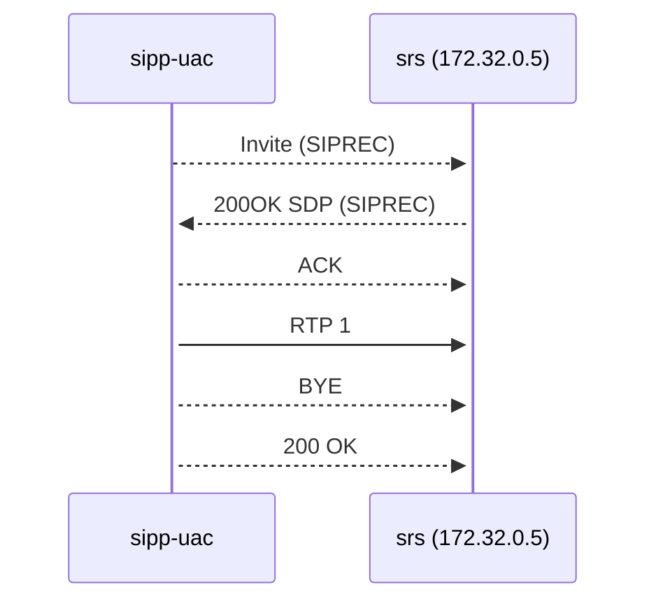

# SRC dev lab

## Diagram




Only test SIP and RTP

### With 1 legs audio simulate simple SRC

```bash
sipp -sf uac_simple_siprec.xml 172.32.0.5:5090 -rsa 172.32.0.5:5090 -t t1 -s 9999 -key caller 8888 -key audio_pcap "pcap/g711a.pcap" -d 8000 -m 1 
```
-d 8000 : pause for 8s to send RTP

### With 1 legs audio simulate sonus

```bash
sipp -sf uac_siprec_sonus.xml 172.32.0.5:5090 -rsa 172.32.0.5:5090 -t t1 -s 9999 -key caller 8888 -key audio_pcap "pcap/g711a.pcap" -d 8000 -m 1
```


## Lunch stress tests from client local machine

    -m 1000 : Max 1000 calls.
    -l 100 : Max 100 concurents calls.
    -r 10 : 10 calls/s.
